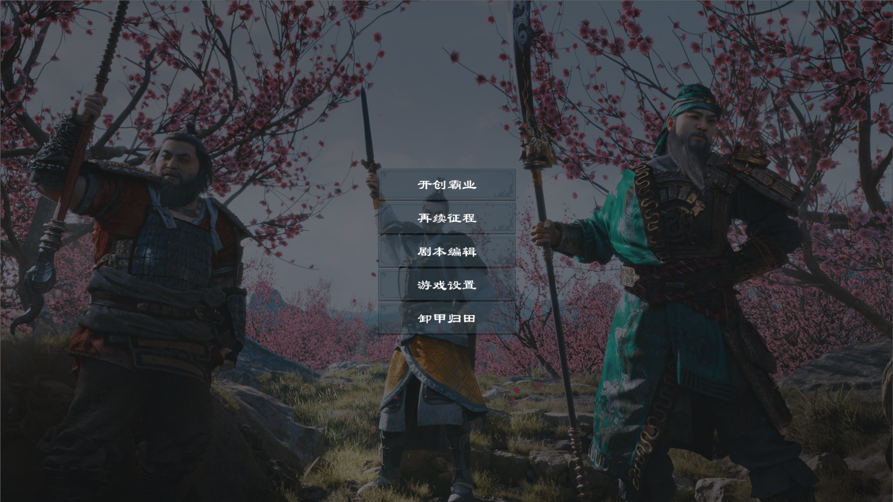
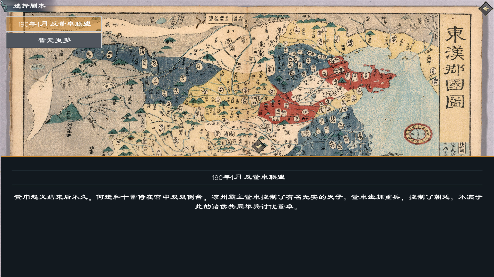
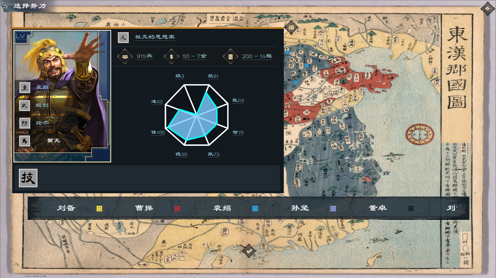
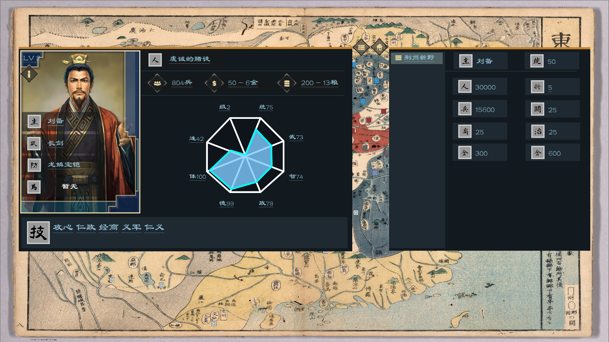

## 实现思路及参考资料

* [godot-4.2中文文档](https://www.bookstack.cn/read/godot-4.2-zh/%e5%85%b3%e4%ba%8e.md)
* [hexagons 地图算法相关](https://www.redblobgames.com/grids/hexagons/#distances)

## 完成的功能

* 主页界面
* 选择势力
* 武将数据
* 地图
* 城市数据
* 仿 `ck3` 人物性格【AI个性】

## 计划

- [x] 内政
- [x] 大战场
- [x] 白兵战

